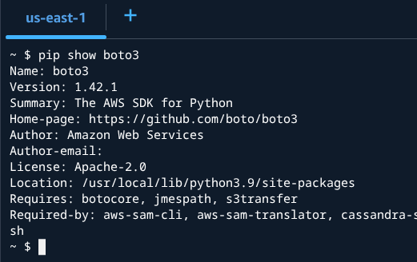

# Instrucciones

### 1. Configuración del entorno:

a. Inicia sesión en **AWS Learner Lab** y asegúrate de que el entorno está activo.
b. Accede a la consola de AWS y verifica que la región seleccionada es **us-east-1** o **us-west-2**, conforme a las restricciones del laboratorio.
c. Usa **AWS CloudShell** o una instancia de EC2 con acceso SSH para ejecutar los scipts.

### 2. Automatización con Python y Boto3:

a. Instala y configuta **Boto3** en el entrono si no está disponible: 
``` 
pip install boto3
```


b. Configura las credenciales de AWS si es necesario:
```
aws configure
```


**Nota.** En Learner Lab, el perfil **LabRole** ya está disponible, por lo que no se deben crear nuevas claves de acceso.

c. Desarrolla un script en **Python (gestionar_ec2.py)** que realice las siguientes accciones:
* Listar todas las instancias en la región de su estado actual.
* Iniciar una instancia específica si está detendia.
* Detener una instancia especifica si está en ejecución.

Codigo base sugerido en Python:

```
import boto3

ec2 = boto3.client('ec2', region_name='us-east-1')

def listar_instancias():
    response = ec2.describe_instances()
    for reservation in response['Reservations']:
        for instance in reservation['Instances']:
            print(f"ID: {instance['InstanceId']}, Estado: {instance['State']['Name']}")

def gestionar_instancia(instancia_id, accion):
    if accion == "iniciar":
        ec2.start_instances(InstanceIds=[instancia_id])
        print(f"Instancia {instancia_id} iniciada.")
    elif accion == "detener":
        ec2.stop_instances(InstanceIds=[instancia_id])
        print(f"Instancia {instancia_id} detenida.")

if __name__ == "__main__":
    listar_instancias()
    gestionar_instancia("ID_INSTANCIA", "iniciar")  # Reemplazar ID_INSTANCIA según corresponda.
```

Codigo final:
```
import boto3
import sys

# Configuración del cliente
ec2 = boto3.client('ec2', region_name='us-east-1')

def listar_instancias():
    print("--- Listado de Instancias ---")
    response = ec2.describe_instances()
    for reservation in response['Reservations']:
        for instance in reservation['Instances']:
            print(f"ID: {instance['InstanceId']} | Estado: {instance['State']['Name']}")
    print("-----------------------------\n")

def gestionar_instancia(instancia_id, accion):
    try:
        if accion == "iniciar":
            ec2.start_instances(InstanceIds=[instancia_id])
            print(f"Comando enviado: Iniciando {instancia_id}...")
        elif accion == "detener":
            ec2.stop_instances(InstanceIds=[instancia_id])
            print(f"Comando enviado: Deteniendo {instancia_id}...")
        else:
            print("Acción no válida. Usa 'iniciar' o 'detener'.")
    except Exception as e:
        print(f"Error al procesar la instancia: {e}")

if __name__ == "__main__":
    # Si se pasan argumentos: python gestionar_ec2.py <id> <accion>
    if len(sys.argv) > 2:
        id_instancia = sys.argv[1]
        accion_usuario = sys.argv[2].lower()
        gestionar_instancia(id_instancia, accion_usuario)
    else:
        # Si no hay argumentos, solo lista
        listar_instancias()
        print("Uso: python gestionar_ec2.py <ID_INSTANCIA> <iniciar|detener>")
```

d. **Automatización con Bash:**
```
#!/bin/bash

# Script para automatizar la gestión de EC2
INSTANCIA_ID="i-0123456789abcdef0" # Cambia esto por tu ID real

echo "Ejecutando mantenimiento de EC2..."

# 1. Listar el estado actual
python3 gestionar_ec2.py

# 2. Ejemplo de lógica: Detener la instancia si es fin de semana (opcional)
# O simplemente ejecutar una acción directa:
python3 gestionar_ec2.py $INSTANCIA_ID detener

echo "Proceso finalizado."
```
### **3.** Crea un script en **Bash (backup_s3.sh)** para generar un **respaldo** de archivos y enviarlo a un **bucket S3** 

a. El script debe:
* COmprimir un derectorio específico.
* Subir el archivo comprimido a un **buckket S3** en la misma región.
* Generar un log con destalles de la operación.

b. Código base sugerido en bash:
```
#!/bin/bash

BUCKET_NAME="mi-bucket-ejemplo"
BACKUP_FILE="backup_$(date +%F).tar.gz"
LOG_FILE="backup.log"

echo "Iniciando respaldo..." >> $LOG_FILE
tar -czf $BACKUP_FILE /ruta/a/respaldo >> $LOG_FILE 2>&1

if aws s3 cp $BACKUP_FILE s3://$BUCKET_NAME/ >> $LOG_FILE 2>&1; then
    echo "Respaldo subido exitosamente." >> $LOG_FILE
else
    echo "Error en la subida del respaldo." >> $LOG_FILE

fi
```
### Ejecución y validación:
a. Ejecuta el script de **Python** y verifica que las instancias se listan y gestionan correctamente.
b. Ejecuta el script de **Bash** y comprueba que el archivo se genera y sube a **S3** exitosamente.
c. Consulta los logs generados para asegurar que no hay errores en la ejecución.

### 5. Optimización y seguridad:

a. Asegura que los scripts no contienen credenciales en texto plano.
b. Implementa manejo de excepciones en **Python** y validaciones en **Bash** para evitar fallos inesperados.
